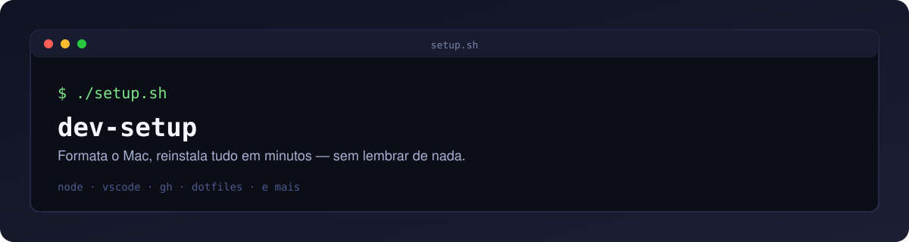

<p align="center">
  
</p>

# dev-setup

## O que é isso? (em bom português)

Formatei meu Mac. Aí veio a pergunta de sempre: "e agora, vou instalar tudo de novo, um por um?" Node, VS Code, GitHub CLI, dbeaver, configurar o zsh bonitinho de novo... só de pensar deu preguiça.

Então fiz esse CLI. Ele te pergunta o que você quer instalar (ou instala tudo de uma vez, se preferir) e cuida do resto sozinho — sem você precisar lembrar o nome de cada ferramenta ou o comando de instalação de cada uma.

Não precisa entender de programação para usar: é só rodar um comando no Terminal e escolher nas setinhas o que você quer. Se você é dev (ou tá virando um), isso aqui resolve o básico pra você já sair feliz e produtivo no seu Mac novo/formatado.

## Uso

```bash
./setup.sh                        # menu interativo de seleção
./setup.sh --list                 # lista as ferramentas disponíveis
./setup.sh --about                # mostra o banner do autor
./setup.sh --all                  # instala tudo, sem menu
./setup.sh --only node,gh,vscode  # instala só o que for passado (ids de --list)
./setup.sh --dry-run --only node  # mostra o que seria feito, sem instalar
./setup.sh --dotfiles             # restaura a configuração de zsh (com backup automático)
./setup.sh --help                 # ajuda
```

## Ferramentas cobertas

| id | Ferramenta |
|---|---|
| `node` | Node.js (LTS) via `nvm`, definido como alias `default` |
| `dotnet` | .NET SDK |
| `gh` | GitHub CLI |
| `vscode` | VS Code |
| `dbeaver` | DBeaver |
| `bruno` | Bruno (API/E2E) |
| `iterm2` | iTerm2 |
| `uv` | uv (gerenciador Python) |
| `pnpm` | pnpm |
| `oh_my_zsh` | oh-my-zsh + Powerlevel10k + zsh-autosuggestions + zsh-syntax-highlighting |
| `claude_code` | Claude Code CLI |
| `antigravity` | Antigravity CLI |

Todo instalador é idempotente: rodar duas vezes seguidas não falha nem reinstala.

## Estrutura

```
setup.sh              entry point
lib/detect_os.sh       SO, arquitetura e path do Homebrew
lib/common.sh          helpers de brew/command usados pelos installers
lib/cli_args.sh         parsing de flags
lib/menu.sh             menu interativo
lib/registry.sh         registro de ferramentas + orquestração
lib/banner.sh           banner de abertura
lib/dotfiles.sh         restauração de dotfiles (symlink + backup)
installers/<tool>.sh    um instalador por ferramenta (contrato: `check`/`install`)
dotfiles/               .zshrc, .p10k.zsh e aliases versionados
```

## Adicionando um novo instalador

1. Crie `installers/<id>.sh` seguindo o contrato dos demais (`check` retorna 0 se já instalado; `install` instala de forma idempotente).
2. Adicione `<id>` em `TOOL_IDS` e a descrição correspondente em `TOOL_DESCS`, em `lib/registry.sh` (arrays paralelos — o projeto evita `declare -A` para manter compatibilidade com o bash 3.2 do macOS).
3. `chmod +x installers/<id>.sh`.

## Compatibilidade

Testado no bash 3.2 (padrão de fábrica do macOS) e macOS arm64 (Apple Silicon). Os paths do Homebrew são resolvidos dinamicamente (`/opt/homebrew` em arm64, `/usr/local` em Intel).

## Sugestões e contato

Tem uma ideia, achou um bug ou quer sugerir uma ferramenta nova? Abre uma [issue](../../issues) aqui no repo.

Também dá pra me encontrar no LinkedIn — tem um resumo rápido de quem eu sou aqui: https://tremdelinks.vercel.app/nathan-amorim
