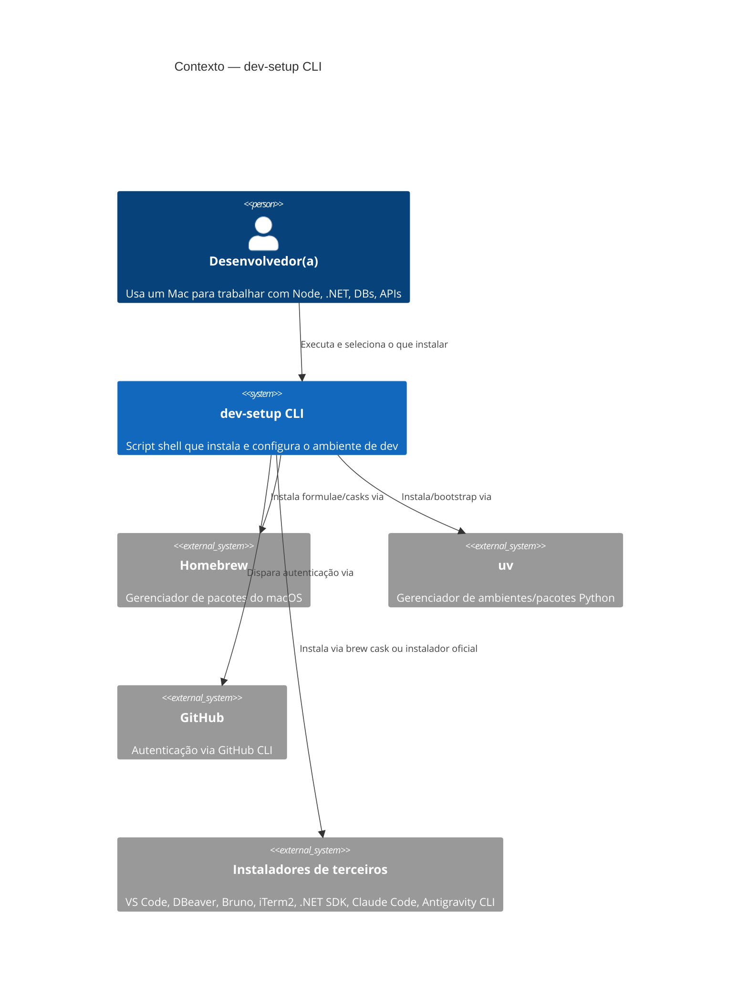
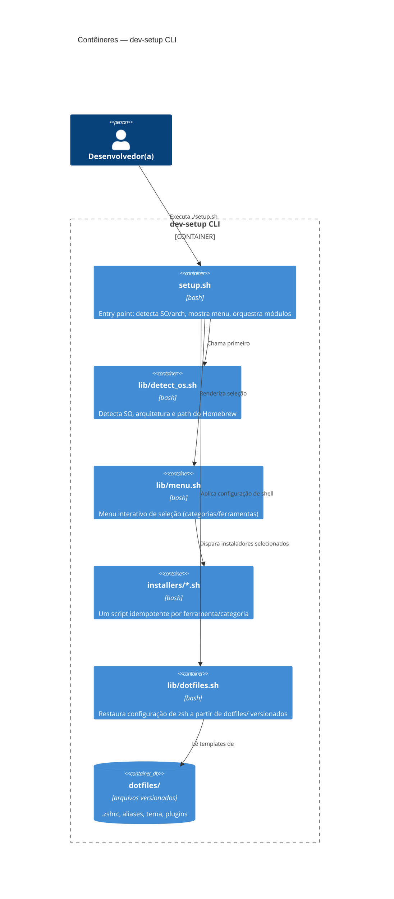

# Critérios técnicos 83bb — CLI de reinstalação do ambiente de dev

**ID:** `83bb` (hash)
**Ref. produto:** `discovery-83bb-dev-cli-installer.md`

## Restrições
- Linguagem: shell script (bash, compatível com o bash do macOS e com zsh como shell padrão de execução do usuário).
- SO alvo inicial: macOS. Detecção de arquitetura obrigatória (`arm64` vs `x86_64`) para resolver o path correto do Homebrew (`/opt/homebrew` vs `/usr/local`).
- Sem dependências externas ao próprio macOS para o bootstrap inicial (o script deve conseguir instalar o Homebrew se ele não existir, sem exigir outra ferramenta previamente instalada).
- Idempotência: cada instalador deve checar se o item já está presente (`command -v`, `brew list`, etc.) antes de agir.
- Nenhuma ação destrutiva sem confirmação explícita do usuário (ex: sobrescrever `.zshrc` existente deve fazer backup antes).
- Segredos (tokens, chaves de API) nunca são versionados nem solicitados pelo script além do necessário para autenticação interativa das próprias CLIs (ex: `gh auth login` é disparado, mas o token não é manipulado pelo script).

## C4 Model — Visão macro

### Nível 1 — Contexto


### Nível 2 — Contêineres (módulos do script)


## Branding do CLI
- Ao iniciar (`./setup.sh`, sem flags, ou via `--about`), o CLI exibe um banner de abertura com:
  - Nome do autor: `nathanramorim`
  - LinkedIn: `linkedin.com/in/nathanramorim`
  - Instagram: `instagram.com/nathanramorim`
- Banner implementado como texto simples (heredoc), sem dependência externa de arte ASCII.
- Critério de aceitação: `./setup.sh --about` imprime as três linhas acima e retorna exit 0.

## Categorias/instaladores identificados
| Categoria | Ferramenta | Via | Observação |
|---|---|---|---|
| Runtime | Node.js | `nvm` (Node Version Manager) | Instalador deve incluir onboarding básico de uso do `nvm` no output |
| Runtime | .NET SDK | Homebrew cask `dotnet-sdk` | Validar disponibilidade da versão desejada |
| VCS | GitHub CLI | Homebrew formula `gh` | — |
| IA/CLI | Claude Code CLI | Homebrew ou instalador oficial | Confirmar canal de instalação suportado |
| IA/CLI | Antigravity CLI | `curl -fsSL https://antigravity.google/cli/install.sh \| bash` | Script remoto oficial — exibir aviso antes de executar |
| Editor | VS Code | Homebrew cask `visual-studio-code` | — |
| DB | DBeaver | Homebrew cask `dbeaver-community` | — |
| API/E2E | Bruno | Homebrew cask `bruno` | — |
| Terminal | iTerm2 | Homebrew cask `iterm2` | — |
| Python | uv | Homebrew formula `uv` (ou script oficial `astral.sh`) | Preferência explícita do usuário sobre pip/venv/conda |
| Shell | zsh completo | dotfiles versionados + symlink/copy | Dotfiles criados do zero nesta iniciativa (sem origem pré-existente a importar) |
| Base | Homebrew | Script oficial `brew.sh` | Bootstrap se ausente |

## Critérios de aceitação executáveis
```bash
# 1. Script existe e é executável
test -x ./setup.sh

# 2. Detecção de SO/arquitetura funciona isoladamente
./lib/detect_os.sh   # deve imprimir SO + arch + path do brew, exit 0

# 3. Modo listagem (sem instalar nada) mostra todas as categorias disponíveis
./setup.sh --list

# 4. Modo dry-run mostra o que seria instalado, sem executar `brew install`
./setup.sh --dry-run --only node,gh,vscode

# 5. Rodar duas vezes seguidas o mesmo instalador não falha (idempotência)
./setup.sh --only gh && ./setup.sh --only gh   # ambos exit 0

# 6. Restauração de dotfiles faz backup do .zshrc existente antes de sobrescrever
test -f ~/.zshrc.bak.<timestamp>   # após rodar ./setup.sh --dotfiles

# 7. Banner de branding exibe autor e redes sociais
./setup.sh --about | grep -q "nathanramorim"
./setup.sh --about | grep -q "linkedin.com/in/nathanramorim"
./setup.sh --about | grep -q "instagram.com/nathanramorim"
```

## Decisões técnicas propostas (a validar em `/nova-feature`)
- Um instalador por ferramenta em `installers/<nome>.sh`, todos seguindo o mesmo contrato (`check()`, `install()`).
- Menu interativo simples com `select` do bash (sem dependência de `fzf`/`gum` para não adicionar pré-requisito antes do Homebrew existir).
- Flags de linha de comando (`--list`, `--dry-run`, `--only`, `--dotfiles`, `--all`) para permitir uso não interativo também (CI-friendly / repetível).
- Dotfiles versionados em `dotfiles/` dentro deste repo, aplicados via symlink (preferível a cópia, para manter atualização contínua).

## Segurança
- Nenhum token, chave ou senha é lido, armazenado ou logado pelo script.
- Qualquer sobrescrita de arquivo existente do usuário (dotfiles) exige backup automático antes.
- `gh auth login`, autenticação de IDEs/CLIs de IA e demais logins continuam sendo feitos interativamente pelo próprio usuário fora do escopo do script.
